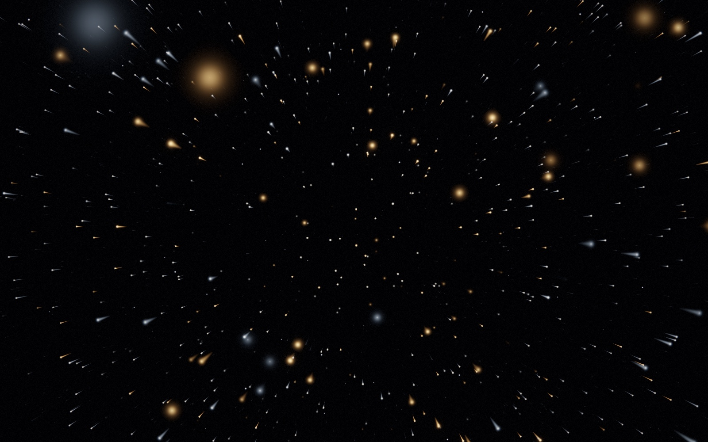
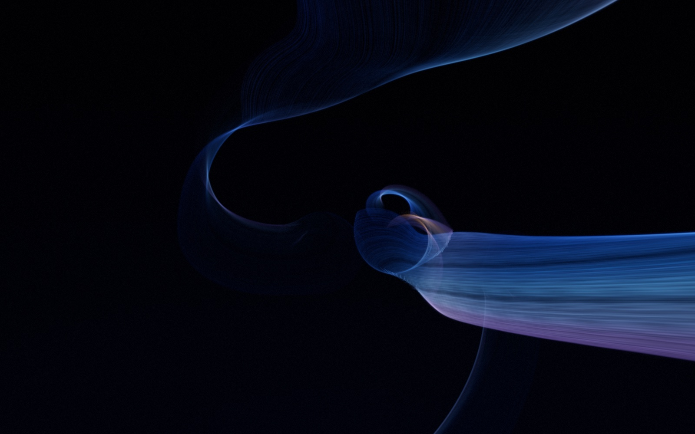
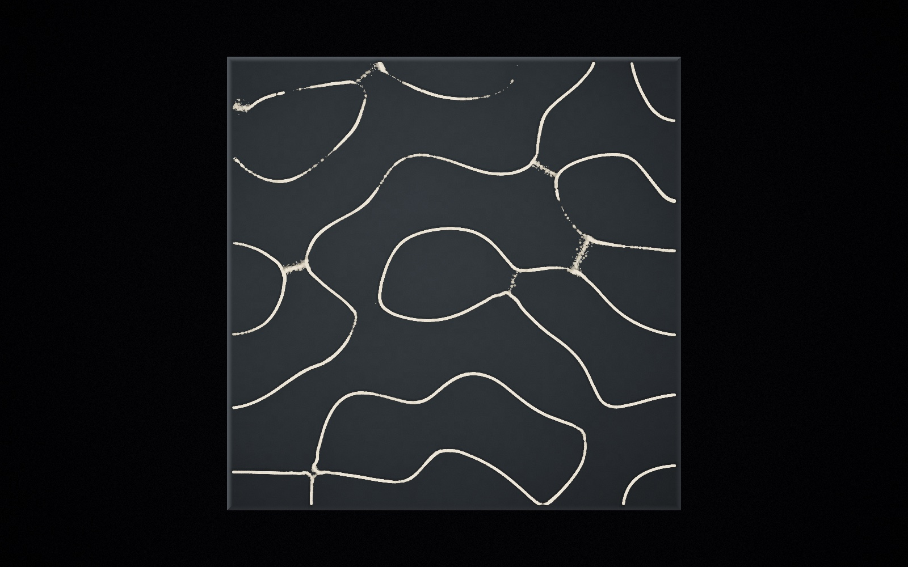

# Murmuration

**[aj8uppal.github.io/murmuration](https://aj8uppal.github.io/murmuration/)**

A WebGPU music visualiser.
A million grains of light are pushed through a curl-noise flow field and forced by the music - not just by how loud it is, but by what it is doing: the key it is in, the tempo it keeps, the moment an instrument arrives, and the passages where it stops to breathe.

The flagship track is Patrick Watson's *Je te laisserai des mots*, but it reads anything you give it - drop in a file, or use the microphone.


The same track: a full passage, then the near-silent bar around 1:00. Nothing is scripted - the field thins, dims and slows because the music did.


And the solo piano opening against a sung phrase. The piano reads struck; the voice, isolated by its centre placement rather than its pitch, arrives as a separate coherent form. The two frames differ in palette because the palette travels - mode chooses the half, a slow swing carries it across the banks.

## Run it

Hosted at [aj8uppal.github.io/murmuration](https://aj8uppal.github.io/murmuration/), or locally:

```sh
./serve.sh          # http://localhost:8173
```

Any static server works; ES modules and `fetch` of the `.wgsl` files mean `file://` will not.

Then pick a source:

- **play the track** - the bundled flagship
- **the nocturne** - a generative ambient piece synthesised in the browser
- **choose a track** / drop an audio file anywhere on the page
- **microphone** - live input, analysed but never routed back to the speakers

`audio/je-te-laisserai-des-mots.mp3` is a personal copy for local playback. It is not mine to redistribute, so keep it out of anything you publish.

## Controls

| key | |
| --- | --- |
| `space` | play / pause (or start the nocturne) |
| `H` | hide the chrome |
| `F` | fullscreen |
| `R` | reseed the particle field |
| `M` | switch to microphone |
| `B` | cycle render mode - only with `?modes=all`, which brings the experimental voyage, current and plate back into the cycle |
| `V` | cycle visual style within particle mode (`shift+V` goes back) |
| `-` `=` | audio sensitivity, `\` resets it to 1.0x |
| `G` | step through the flow behaviours (`shift+G` returns to automatic) |
| `0` | reset zoom |
| `1` `2` `3` | quality: 260k / 620k / 1.2M particles |

| pointer | |
| --- | --- |
| drag | pull the field around; the path keeps attracting for ~10s |
| click | shockwave |
| shift+drag / shift+click | repel and implode instead |
| scroll | zoom |

The chrome fades on its own after a few seconds of stillness.

On a handheld the piece starts at the lightest preset and trims resolution, since a phone GPU will not carry the desktop defaults. Pinch replaces the scroll wheel.

## How it works

Every frame runs six GPU passes:

| pass | what it does |
| --- | --- |
| `flowMain` (compute) | bakes the curl-noise field into a small `rg16float` texture once per frame, so the sim samples it instead of evaluating six simplex octaves per particle |
| `simMain` (compute) | integrates every particle: flow-field advection, per-particle frequency-band forcing, beat shockwave, containment, pointer and letterform attraction |
| background | fbm aurora sheets, star field, central haze, rendered at reduced resolution and blitted up - it is smooth enough that the difference does not read, and it was the single largest per-pixel cost |
| particles | one instanced quad per particle, stretched along its velocity, capsule-gaussian falloff, additive |
| bloom downsample | 13-tap Karis filter down a 6-level mip chain, soft-knee prefilter on the first reduction |
| bloom upsample | 9-tap tent back up the chain, additive |
| composite | beat shockwave warp, chromatic aberration, anamorphic streak, ACES tonemap, split-tone, vignette, grain, dithered sRGB |

Particles carry a `depth` value that drives parallax, sprite size, and brightness, so near grains defocus into bokeh while far grains stay tight and bright.

Both sprite footprint and alpha are normalised against particle count - footprint by `N^-0.4`, alpha by `N^-0.2`. Total ink stays constant, so brightness does not change between presets, and total fill grows only as `N^0.2` rather than linearly. More particles buy finer detail at close to the same cost.

### Modes

Only the particles are in the cycle.
The voyage, the current and the plate below are kept in the code to be worked on, and `?modes=all` brings them back under `B`.

Four rendering approaches, different algorithms rather than different settings; with `?modes=all` they are cycled with `B`, and the piece always opens on the particles.

**particle** is the simulation described above: a compute pass integrating ~620k grains through a flow field, drawn as additive sprites.
Its five styles are below.

**voyage** is a flight.
A camera moves fast along a slowly curving path through a field of lights in the black, and the piece is what passes it: every light draws a trail across the frame, bright at its head and fading down its tail, short when the music rests and long when it drives, near ones sweeping by in arcs and swelling into soft discs.
It is meant to feel like the loops that accompany a lo-fi track - clean, quiet, and going somewhere.



It is neither a particle simulation nor a raymarch.
Every light is derived in the vertex stage from nothing but its instance index and a hash, so there is no buffer and no compute pass behind it: about eight thousand instanced sprites, drawn through a real perspective camera into the same HDR target as the particles, so the bloom chain and the grade are shared.
Lights live in path coordinates - an arc distance along the flight and a lateral offset in the path's moving frame - and wrap inside a window around the camera, with the wrap count folded into the hash, so a light that falls behind reappears far ahead as a different one.
The path is periodic and the CPU keeps the travelled distance inside the period, which holds float precision however long the flight.

Three populations share the field.
Dust is most of it: small points that carry depth and speed.
Lanterns are the point of the flight: bodies of light, a quarter of them amber against whatever the mood makes of the rest, that bloom as they come close and draw the longest wakes.
A handful of heroes are the near passes, always warm, with a compact highlight that survives focus.
None of them is drawn as a disc - a lens-drawn disc read as a sphere, and these are lights, not objects - but as a soft gaussian body with a wide halo.
A thin-lens model sizes each one in pixels - a circle of confusion on top of the light's own core - with focus set far out, so the middle distance is soft orbs and only the far field is crisp.
The trail is the light's own motion across the frame over a tenth of a second, projected from the previous camera pose, soft-limited so a near pass never becomes a bar across the screen.
Ink is roughly conserved as a light defocuses or smears - a big disc is a dim disc - but not strictly for trails, which would otherwise vanish: a long exposure is allowed to gather light.

Two things had to be designed out, and both are worth knowing before touching the numbers.
A field seen deeper than it is wide bunches into a knot at the vanishing point - the far half of the window all lands in one central ellipse - so each population fills a disc wider than the depth it can be seen to, and is faded out by view depth before that can happen.
And the particle grade fights the flight: its beat warp, deep aspect-weighted vignette and anamorphic streak all turn an open field back into a corridor, so the flight has its own - fixed optics, a shallow round vignette, and a lower bloom knee so every light carries a halo.

Everything about the flight is the music's, and nothing snaps.
The flight breathes in phrases.
A phrase's energy is level and density over the last couple of seconds against a seven-second baseline; rising is an inhale, falling an exhale.
Speed swells with the inhale - roughly 5 to 30 units a second under music - and is braked almost to a stop by a lull, so a quiet passage genuinely coasts and its trails shrink back to points; it accelerates over three seconds and brakes in two.
Each inhale also picks a direction - the way the melody has been leaning, by relative pitch; failing that, back toward the middle; failing that, the other way from last time - and the camera sweeps into a turn of five to eight seconds, banking in proportion to how fast it is turning, then a spring eases the gaze home.
What is driven is the turn *rate*, never the heading, on a sine window with its acceleration capped, so a sweep begins and ends at rest the way a real one does.
Driving the turn for as long as the swell lasted was tried first and parked the heading against its limit through a whole rising passage.
Voyage costs 2.3 ms at 2400x1500 in headless Chrome, against 19.2 ms for the particle pass, and skips the flow, simulation and backdrop passes entirely since none of them are visible.
The trail is projected from the previous camera pose with the turn rewound as well as the travel, so trails slant and arc through a bend.
Underneath, the path itself bends on curves so wide that the heading turns under a degree a second at full speed, and the camera looks down the road - at a point about a second ahead - rather than along the instantaneous tangent.

**current** is a fluid cosmic wave, made of strands, flown through.
A sheet of silk runs along the flight path without end.
Every eighty-odd units it rolls closed around the path - a full turn and a third, its radius tightening inward so the roll spirals into a hollow - and the hollow sits on the flight line, so the camera approaches it as a dark mouth ahead, passes through the roll with the strands wrapping past, and comes out to the next.
Between rolls the sheet unrolls into a broad sweep that peels aside and flows past; a wider, dimmer echo of it runs far to one side, its rolls out of phase, for parallax, and a veil further out appears only when the music is full.
The sheet is drawn not as a surface but as its strands: a few hundred fine filaments, each at a fixed position across the sheet and following it along its whole length, banded and gapped like the rings of Saturn.
Where the sheet turns edge-on the strands pile up on screen and the light gathers on the fold; where it faces the eye it is a striated silk.
Light lives in the contours.



Everything is periodic in the path, on integer harmonics of the flight's period, so the travel never wraps visibly: the rolls sit at stations along it, each its own by a hash of its index - shifted by up to a third of the spacing, reaching seven to twelve units, turning one way or the other, its centre a unit off the line, one in seven left out - the sheet's spine turns slowly about the path and snakes, and the cross-section's twist and the rings repeat with the period.
The form also evolves on slow clocks of its own - the wrap, the radius, the roll stations and the gaps all drift over forty seconds to three minutes - a little faster when the music is full.
Through a roll the strands twist helically, so seen from inside they curve around the tube instead of running straight down it and converging into a corridor; between rolls the sheet snakes enough that its strands bend on screen.
Each strand is a line, a gaussian sigma wide on screen with a halo, extruded by the world width that projects to that along a world-space perpendicular - the cross of the strand's tangent and the eye ray, continuous along the strand - with true clip depth throughout, sampled from a little behind the camera to two hundred units ahead with the samples crowding toward it; tangents are taken over a fixed baseline, since near the camera the samples are inside float precision at path coordinates in the thousands.
The halo about each strand widens with the projected spacing of the strands and carries more light, so the sheet is a luminous surface whose body keeps its brightness as it comes close, while the line itself keeps the striation; along a limb, where the sheet turns edge-on and its strands stack, the ring pattern and every per-strand variation flatten so the limb reads as one line rather than a row of beads.
The strands accumulate radiance and thickness in a target of their own, and a resolve folds them into the scene as silk: where they pile up the light saturates toward the strands' own colour instead of summing on toward white.
The far wall of a roll, the side of the spine away from the eye, is dimmer: silk seen through silk.
Cobalt at the outer lip, through blue to a dusty violet inward; peach and coral only on the middle of the rolled sheet, cooling toward the inner lip, and mostly on its underside, more of it and further across the sheet as the music warms.

The camera is the flight's: the path, the breathing speed and the sine-window gaze sweeps of the voyage, banking into the bends by the lateral acceleration they earn, all through critically damped springs.
It flies slower here - a pass through a roll should take a breath, not a blink - at four to twenty-two units a second on the phrase, never below a walking pace in a lull, the speed following its target through a critically damped spring so its accelerations are continuous; the gaze sweeps are gentler than the voyage's, since the sheet brings the motion.
Each roll station closes as much as the music is full: its closure follows the phrase through a spring while the station is still distant and freezes thirty units before the encounter, so a quiet passage flies beside open sweeps, a rising one rolls the sheet shut around the path, and the roll ahead still answers the music you are hearing rather than a phrase that ended half a minute before.

The music is the flight and the light.
Each band's envelope is normalised adaptively, placed between a floor that falls quickly and rises slowly and a ceiling that rises at once and decays over a quarter of a minute, so a quiet record moves the form as much as a loud one; silence is gated on absolute level.
The speed follows the phrase; the light fills with the phrase; the bass is the form's breath alone, slowly, in the rolls' depth and radius; the light flowing along the strands runs toward the lens in the camera's own coordinate - one wave per beat while the tempo is trusted, else at the mids' pace - whatever the speed, since measured along the path it was carried by the flight and stalled or raced with it; the mids fill in the faint strands and launch pulses that run away down the sheet from the camera as light and a bulge - a beat sends one when the tempo is trusted, else an onset or a rising mid does, two at a time and only ever into a slot whose pulse has faded, and an instrument's entrance a broader, quicker one; the highs bring up the fine ripple and glints on the contours; the phrase's energy fills in the faint strands, brightens the echo and warms the inner curl, further across the sheet the fuller the music; the voice warms it further; a lull dims and opens the form.

The current costs about 4.0 ms at 2400x1500 in headless Chrome, and holds 60 fps at the lavish preset.

**plate** is sand on a vibrating plate, seen from above.
The plate rings in a superposition of its modes, chosen by the music: the strongest few spectral peaks each pick one of thirty-six modes of the plate by pitch, two semitones apart, and set its amplitude by their energy, so the nodal lines lean with every note; a mode that gives way to another fades over a second while the new one rises, so the figure crossfades rather than snaps, and the pairing of each mode's two shapes follows the mode, so the same chord always draws the same figure; and the grains slide down the gradient of the vibration's energy - the square of the summed mode shapes - while being shaken in proportion to the vibration where they stand, so they gather on the nodal lines.
A figure forms while a chord holds, crisp in a lull, and dissolves and reforms when the harmony moves; the bass is a tremor in the sand and a breath in the light; a beat throws the sand up - every grain larger for an instant and lifted off its shadow toward the light - and it settles again.
Matte grains on a bevelled slate under a raking light from the upper left: a density map of the sand, built each frame from the grains and normalised by its expected mean so the look does not depend on the preset, lights the ridges on one side, shadows the plate beside them and brightens the sand where it piles above the mean; a faint sheen of the plate's own vibration on the slate lets the harmony register the instant it changes, while the sand takes its seconds to follow.



The peaks are the strongest three of the smoothed bins between the low strings and the top of the voice, each standing above its neighbours, with the harmonics of a stronger, lower peak folded into it; each holds a mode slot that is retaken only by a peak a third stronger for a while, and fades over a couple of seconds when its peak has gone, so the figure never flickers between harmonics.
Four hundred thousand grains at the full preset move in a compute pass and are drawn as grains a little over a pixel across, opaque over the slate.
The two mode shapes of a pair are combined with a fractional weight: the exact antisymmetric pairing put a dead-straight diagonal node across the plate.
The plate costs about 7.6 ms at 2400x1500 with its density map, and holds 60 fps at the lavish preset.

### Sources

The intro offers the flagship track, the generative nocturne, a file (or a drop anywhere), a SoundCloud link, another tab's audio, and a microphone or loopback device.
Every source lands on the same analysis bus; nothing downstream of it reaches the speakers except what is meant to.
While the music plays the page holds a screen wake lock, the way a video does, so the machine does not sleep mid-song; it is released on pause, and taken again when a hidden tab comes back - on https or localhost, where the browser allows it.

**SoundCloud.** Playing a SoundCloud link needs an app registered at developers.soundcloud.com - an Artist Pro account is required to register one - with this page's URL among its redirect URIs; its client id goes in `src/config.js` (or in localStorage under `murmuration.soundcloud.clientId`).
The client id is public by design: sign-in is OAuth 2.1 with PKCE against `secure.soundcloud.com`; tokens live in localStorage, access tokens last about an hour, refresh tokens are single use and every refresh stores the new pair.
One wrinkle: SoundCloud requires the app's client secret for the token exchange even with PKCE, and a secret cannot live on a public page, so the exchange goes through a small proxy that holds it - the Cloudflare Worker in `tools/soundcloud-proxy` (`npx wrangler deploy`, then `npx wrangler secret put SC_CLIENT_SECRET`), whose URL goes in `src/config.js` as `tokenProxy`; it answers only the page's own origin.
For a test on your own machine alone, a secret in localStorage under `murmuration.soundcloud.clientSecret` lets the page call SoundCloud directly; never on a deployed page.
The registered redirect URI must match the page's URL character for character, scheme and trailing slash included: `https://aj8uppal.github.io/murmuration/` for the deployed page.
With a token a link resolves to a track, a playable track's `/streams` gives the URL of its transcoded audio, and a media element plays it into the bus - asking for CORS, because without it a cross-origin stream could play but would read as silence to the analysers, and in anonymous mode the element refuses such a stream outright.
Whether SoundCloud's media CDN sends those headers is not something the terms promise; a refused stream is reported in a sentence that points at tab capture, and a stream that somehow plays in silence is caught the same way.
Tracks whose `access` is `preview` or `blocked` are refused with a word; the HUD credits the uploader with a link to the track on SoundCloud, as the terms ask of a custom player.

**Capture a tab.** The screen-share picker, with "share tab audio" ticked, reads whatever another tab is playing - SoundCloud in its own player, or anything else - through the live-input path with its slow automatic gain; the video track is stopped at once.
It needs no account and no key, and it is the way to play SoundCloud that the terms cannot object to.
Chrome only, as of this writing.

### Styles

Five treatments, cycled with `V` and remembered between sessions. A style changes how a grain is drawn, not what the music is doing - `mood` still chooses the palette, `flowMode` still chooses the motion, and the field still breathes.

| style | identity |
| --- | --- |
| nebula | the original: soft silk, generous bloom |
| ink | sparse hard-edged strokes, near-monochrome, almost no bloom |
| constellation | tight bright points instead of filaments |
| ribbon | long calligraphic strands, fewer and continuous |
| etching | thin hard scratches, like dry-point |

Each is a set of multipliers on radius, streak length, alpha, falloff sharpness, bloom, saturation, contrast, and what fraction of the population is drawn at all.

That last one is not optional. Some looks cannot be reached by dimming: a soft wide sprite spread across the whole population covers the frame no matter how faint each one is, which is uniform fog rather than distinct forms. A sixth style, bokeh, was cut for exactly this - even culled to 0.6% of the population it would not resolve into discs, and a weak fifth option is worse than four strong ones.

Integrated ink is roughly `radius * (streak + radius) * alpha / (2 * sharp)`. The first pass at these numbers left ink at 0.49 and constellation at 0.17 against nebula's 1.0, which rendered as a near-black screen and a scattering of almost nothing. Worth checking that figure when editing.

### Sensitivity

`-` and `=` scale how hard the music drives the field, from 0.4x to 3x, and the setting is remembered. It deliberately does not scale everything equally: motion and structure take the full multiplier, transients take it to the power 0.6, and exposure and bloom are capped. Turning sensitivity up should make the field move more, not glare more.

### Look

Five palette banks - ocean, ember, violet aurora, silver, cold neon - crossfade on a continuous `mood` value, and four flow behaviours - curl silk, radial rays, vortex braids, laminar sheets - crossfade on `flowMode`. Both are driven by what the music is doing rather than by a script: minor keys sink into the cold banks and major ones climb the warm banks, sparse passages get laminar sheets and busy ones get braids and rays.

### Audio

Everything routes through one analysis bus, whatever the source, and nothing downstream of it reaches the speakers - so microphone input can be measured without being played back.

The bus feeds three analysers, because the jobs want different windows. A 4096-bin FFT drives the visible spectrum: folded into 128 log-spaced bins (28 Hz - 16 kHz) with a mild high-frequency tilt, fast attack and slow release. Each particle owns a `band` in `[0, 1)` and reads that bin every frame, so the cloud separates into layers that answer different parts of the mix.

### Musicality

`src/analysis.js` works out what the music is *doing*. It runs on FFT frames, so it works for anything you play, not just the bundled track.

**Key and mode.** An 8192-bin FFT gives fine enough frequency resolution to separate semitones. Bins between 196 Hz and 2100 Hz are folded into 12 pitch classes, weighted by how close each bin sits to its semitone centre, and the resulting chroma vector is correlated against all 12 rotations of the Krumhansl-Kessler major and minor profiles. The winning rotation is the key; the gap between the best major and best minor fit is the mode, and how *cleanly* one beats the other is the confidence. On the bundled track this settles on B minor at 0.74 confidence, which is the song's actual key.

**Tempo.** A 1024-bin FFT with no smoothing gives spectral flux, resampled onto a fixed 60 Hz grid so autocorrelation lags map to a constant time base however the frame rate wanders. Autocorrelating ~8.5 s of that envelope over lags of 48-180 BPM gives the pulse. Autocorrelation is equally happy at half or double the true tempo, so candidates at both octaves are checked and the one landing in a musical range wins. A phase-locked loop tracks the beat between estimates, nudged by onsets rather than reset by them. Rubato playing genuinely defeats this - the confidence is reported honestly and the visuals scale their response by it.

Live input reads a shorter stretch of history more often, so the tempo follows a player rather than a recording: measured against a 100 to 140 BPM change, live settles in 2.3s where the recorded path takes 6.9s. Recorded playback keeps the long window, which is steadier - autocorrelation over four seconds is markedly noisier than over eight, and a finished mix has no reason to need the responsiveness.

**Instrument entries.** Six log-spaced bands each carry a fast and a slow envelope. A band that had been quiet and suddenly is not registers as an arrival, with a cooldown so one entry does not fire repeatedly.

**The voice.** Frequency bands cannot separate a vocal from a piano - on this track they share the same octaves. Stereo placement can: a lead vocal is mixed dead centre and an arrangement is spread wide, so `(L+R)` against `(L-R)` in the vocal band isolates the singer where a frequency split cannot.

Two details decide whether this works. First, the comparison has to happen in energy rather than in dB: a dB gap says how much louder the centre is, which is the same number whether the passage is a whisper or a wall of strings, while summed energy says how much centred material there actually is. Second, the piano on this track is centre-panned too, so there is a large constant floor of centred energy and the vocal is the excursion above it - normalising against a running ceiling alone gave 1.4x separation between sung and instrumental passages, and tracking the floor as well gives 3.5x.

A mono source has no side channel at all, which would make every bin look perfectly centred. Confidence tracks the track's overall stereo width, so mono files and microphone input report that the test is meaningless instead of claiming a permanent vocal.

**Struck against held.** Per band, how far the fast envelope surges above that band's own running level. A piano and a string section can occupy the same octaves and still look nothing alike: the piano leaps above its own level on every strike and decays away, the strings sit on theirs. Measured on the flagship track this reads 0.71 percussive through the solo piano opening and 0.06 on the held strings.

**Density and the breath.** Loudness alone does not say whether music is full: on this track the sub band sits near 0.5 even through a near-silent bar. So fullness is a perceptually weighted band average that leans on the upper middle. It is judged against the track's own running ceiling rather than an absolute one, so a quiet recording is not one long lull. Onset rate is deliberately a minor term - a sparse piano has *more* attacks per second than a sustained string swell, so leaning on it would call the quietest passage the busiest. The inverse of density is the lull, which rises gently and falls promptly, and drives the breath: the field opens out and slows as the music rests, then gathers as it returns.

Traced across the flagship track under continuous playback, the breath lands where a listener would feel it:

| section | density | lull | breath |
| --- | --- | --- | --- |
| 0:11-0:50, piano then strings | 0.89-0.98 | 0.00 | 0.00 |
| 0:55-1:10, the near-silent bar | 0.19-0.41 | 0.79 | 0.55 |
| 1:11-2:28, verse and instrumental | 0.84-0.96 | 0.00 | 0.00 |
| 2:34-2:40, the fade | 0.00-0.14 | 0.90 | 0.90 |

Key detection holds B minor 48% of the track and F# minor 29% - the tonic and dominant of the song's key.

## Sources

Anything served as plain audio with permissive CORS can be analysed: the bundled track, a dropped file, or a stream. Spotify cannot, because its playback SDK decodes through DRM and is desktop-only besides - see [docs/spotify.md](docs/spotify.md) for what is and is not possible there, and how to verify it.

The input picker also selects any audio input device, which includes a loopback device such as BlackHole. That is how you point the piece at another application's output and get real analysis of it.

## Layout

```
index.html            shell, intro, HUD
styles.css
src/main.js           orchestration, camera, input
src/renderer.js       device, pipelines, frame graph
src/audio.js          playback (file / mic / generative) and the analysis bus
src/analysis.js       key, mode, tempo, onsets, instrument entries, the breath
src/song.js           flagship track metadata
src/shaders/*.wgsl    common (noise, palette, tonemap) + one file per pass
tools/bench.sh        per-preset frame cost
```

`common.wgsl` is prepended to every other module at load time, so the uniform struct and helpers are declared once.

## Requirements

WebGPU: Chrome/Edge 113+, Safari 26+, or Firefox with WebGPU enabled.

GPU time per frame on an M-series Mac at 1800x3043 (5.5MP, a Retina window), track playing:

| preset | particles | GPU / frame | headroom |
| --- | --- | --- | --- |
| calm | 260k | 4.23 ms | 236 fps |
| full | 620k | 8.07 ms | 124 fps |
| lavish | 1.2M | 11.85 ms | 84 fps |

4.6x the particles for 2.8x the GPU time, which is the point of the footprint normalisation above.

These are GPU-time numbers, not wall clock, and the distinction matters: measured on a machine at load 7 the same configurations read 13/19/29 ms of wall clock, because the frame loop was contending with everything else running. Wall-clock frame deltas are worth watching for what a user experiences, but they are the wrong instrument for judging a rendering change.

The renderer also steps the quality down on its own if it sits below 42 fps.

To re-measure on your own machine:

```sh
./tools/bench.sh          # median frame time per preset, at ~5.5MP
./tools/bench.sh 1.0      # or pick your own resolution scale
```

The musical analysis has its own tests, driven by synthetic FFT frames with known answers - triads it should name, pulses at a known BPM, a loud passage collapsing into a quiet one:

```sh
npm test                  # node tools/test-analysis.mjs
```

And a whole track can be run through the analysis offline, faster than real time:

```sh
node tools/analyse-track.mjs audio/je-te-laisserai-des-mots.mp3
```

This mirrors what the `AnalyserNode`s feed the analyser - same FFT sizes, window, dB mapping and smoothing - and prints a timeline plus a summary against the known vocal passages. It exists because the browser is the wrong place to validate this: the running ceilings need continuous playback to calibrate, so spot-probes on a freshly loaded page report whatever the last few seconds looked like, and a 165-second trace loses everything if the tab goes away. Eight seconds and repeatable beats three minutes and fragile.

It reports the median raw `requestAnimationFrame` delta rather than the on-screen fps, which is a smoothed average and hides stalls. The script's header documents why it closes tabs between runs and reloads the page for each configuration - both matter more than they sound like they should.
