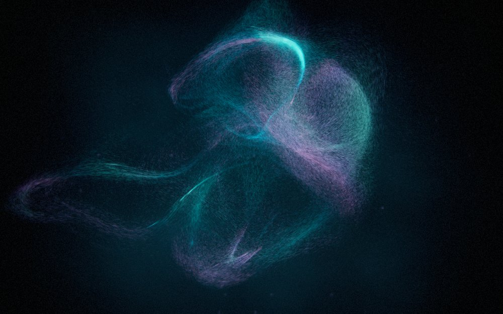
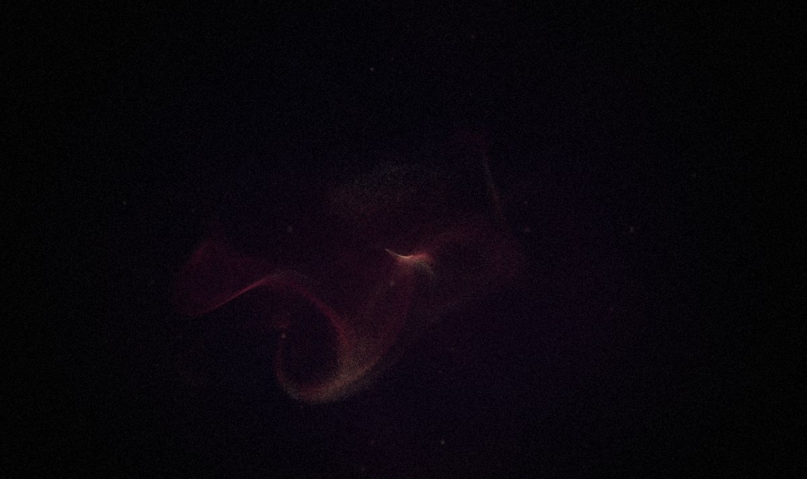
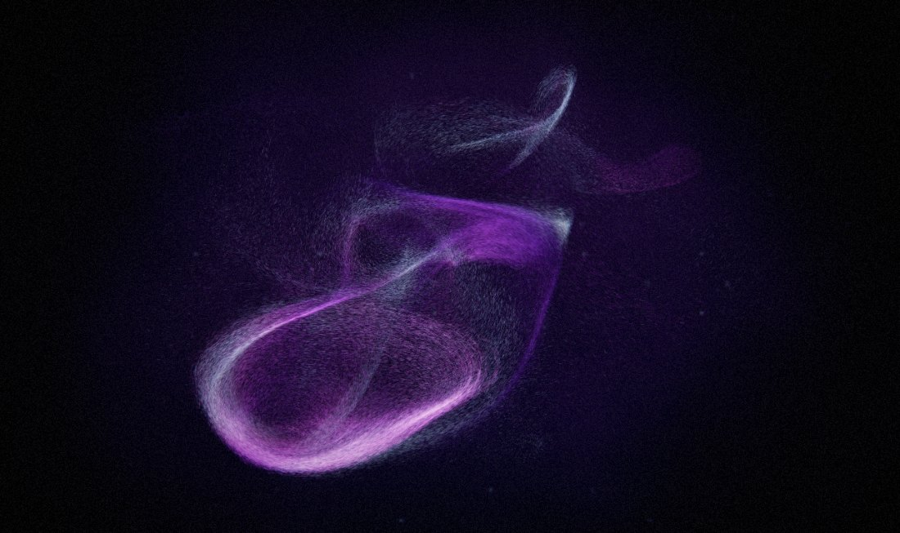
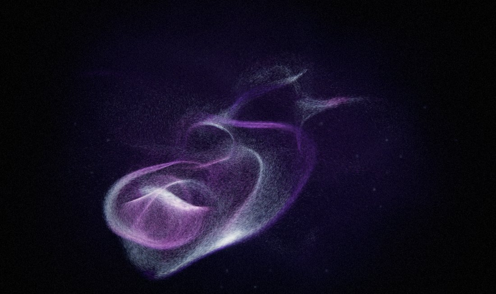

# Murmuration

**[aj8uppal.github.io/murmuration](https://aj8uppal.github.io/murmuration/)**

A WebGPU music visualiser.
A million grains of light are pushed through a curl-noise flow field and forced by the music - not just by how loud it is, but by what it is doing: the key it is in, the tempo it keeps, the moment an instrument arrives, and the passages where it stops to breathe.

The flagship track is Patrick Watson's *Je te laisserai des mots*, but it reads anything you give it - drop in a file, or use the microphone.





The same track fifteen seconds apart: a full passage, then the near-silent bar at 1:06. Nothing is scripted - the field thins, dims and slows because the music did.





And the solo piano opening against a sung phrase. The piano reads struck and warm; the voice, isolated by its centre placement rather than its pitch, arrives as a separate coherent form.

## Run it

Hosted at [aj8uppal.github.io/murmuration](https://aj8uppal.github.io/murmuration/), or locally:

```sh
./serve.sh          # http://localhost:8173
```

Any static server works; ES modules and `fetch` of the `.wgsl` files mean `file://` will not.

Then pick a source:

- **play the track** - the bundled flagship
- **the nocturne** - a generative ambient piece synthesised in the browser
- **choose a track** / drop an audio file anywhere on the page
- **microphone** - live input, analysed but never routed back to the speakers

`audio/je-te-laisserai-des-mots.mp3` is a personal copy for local playback. It is not mine to redistribute, so keep it out of anything you publish.

## Controls

| key | |
| --- | --- |
| `space` | play / pause (or start the nocturne) |
| `H` | hide the chrome |
| `F` | fullscreen |
| `R` | reseed the particle field |
| `M` | switch to microphone |
| `G` | step through the flow behaviours (`shift+G` returns to automatic) |
| `0` | reset zoom |
| `1` `2` `3` | quality: 260k / 620k / 1.2M particles |

| pointer | |
| --- | --- |
| drag | pull the field around; the path keeps attracting for ~10s |
| click | shockwave |
| shift+drag / shift+click | repel and implode instead |
| scroll | zoom |

The chrome fades on its own after a few seconds of stillness.

On a handheld the piece starts at the lightest preset and trims resolution, since a phone GPU will not carry the desktop defaults. Pinch replaces the scroll wheel.

## How it works

Every frame runs six GPU passes:

| pass | what it does |
| --- | --- |
| `flowMain` (compute) | bakes the curl-noise field into a small `rg16float` texture once per frame, so the sim samples it instead of evaluating six simplex octaves per particle |
| `simMain` (compute) | integrates every particle: flow-field advection, per-particle frequency-band forcing, beat shockwave, containment, pointer and letterform attraction |
| background | fbm aurora sheets, star field, central haze, rendered at reduced resolution and blitted up - it is smooth enough that the difference does not read, and it was the single largest per-pixel cost |
| particles | one instanced quad per particle, stretched along its velocity, capsule-gaussian falloff, additive |
| bloom downsample | 13-tap Karis filter down a 6-level mip chain, soft-knee prefilter on the first reduction |
| bloom upsample | 9-tap tent back up the chain, additive |
| composite | beat shockwave warp, chromatic aberration, anamorphic streak, ACES tonemap, split-tone, vignette, grain, dithered sRGB |

Particles carry a `depth` value that drives parallax, sprite size, and brightness, so near grains defocus into bokeh while far grains stay tight and bright.

Both sprite footprint and alpha are normalised against particle count - footprint by `N^-0.4`, alpha by `N^-0.2`. Total ink stays constant, so brightness does not change between presets, and total fill grows only as `N^0.2` rather than linearly. More particles buy finer detail at close to the same cost.

### Look

Five palette banks - ocean, ember, violet aurora, silver, cold neon - crossfade on a continuous `mood` value, and four flow behaviours - curl silk, radial rays, vortex braids, laminar sheets - crossfade on `flowMode`. Both are driven by what the music is doing rather than by a script: minor keys sink into the cold banks and major ones climb the warm banks, sparse passages get laminar sheets and busy ones get braids and rays.

### Audio

Everything routes through one analysis bus, whatever the source, and nothing downstream of it reaches the speakers - so microphone input can be measured without being played back.

The bus feeds three analysers, because the jobs want different windows. A 4096-bin FFT drives the visible spectrum: folded into 128 log-spaced bins (28 Hz - 16 kHz) with a mild high-frequency tilt, fast attack and slow release. Each particle owns a `band` in `[0, 1)` and reads that bin every frame, so the cloud separates into layers that answer different parts of the mix.

### Musicality

`src/analysis.js` works out what the music is *doing*. It runs on FFT frames, so it works for anything you play, not just the bundled track.

**Key and mode.** An 8192-bin FFT gives fine enough frequency resolution to separate semitones. Bins between 196 Hz and 2100 Hz are folded into 12 pitch classes, weighted by how close each bin sits to its semitone centre, and the resulting chroma vector is correlated against all 12 rotations of the Krumhansl-Kessler major and minor profiles. The winning rotation is the key; the gap between the best major and best minor fit is the mode, and how *cleanly* one beats the other is the confidence. On the bundled track this settles on B minor at 0.74 confidence, which is the song's actual key.

**Tempo.** A 1024-bin FFT with no smoothing gives spectral flux, resampled onto a fixed 60 Hz grid so autocorrelation lags map to a constant time base however the frame rate wanders. Autocorrelating ~8.5 s of that envelope over lags of 48-180 BPM gives the pulse. Autocorrelation is equally happy at half or double the true tempo, so candidates at both octaves are checked and the one landing in a musical range wins. A phase-locked loop tracks the beat between estimates, nudged by onsets rather than reset by them. Rubato playing genuinely defeats this - the confidence is reported honestly and the visuals scale their response by it.

**Instrument entries.** Six log-spaced bands each carry a fast and a slow envelope. A band that had been quiet and suddenly is not registers as an arrival, with a cooldown so one entry does not fire repeatedly.

**The voice.** Frequency bands cannot separate a vocal from a piano - on this track they share the same octaves. Stereo placement can: a lead vocal is mixed dead centre and an arrangement is spread wide, so `(L+R)` against `(L-R)` in the vocal band isolates the singer where a frequency split cannot.

Two details decide whether this works. First, the comparison has to happen in energy rather than in dB: a dB gap says how much louder the centre is, which is the same number whether the passage is a whisper or a wall of strings, while summed energy says how much centred material there actually is. Second, the piano on this track is centre-panned too, so there is a large constant floor of centred energy and the vocal is the excursion above it - normalising against a running ceiling alone gave 1.4x separation between sung and instrumental passages, and tracking the floor as well gives 3.5x.

A mono source has no side channel at all, which would make every bin look perfectly centred. Confidence tracks the track's overall stereo width, so mono files and microphone input report that the test is meaningless instead of claiming a permanent vocal.

**Struck against held.** Per band, how far the fast envelope surges above that band's own running level. A piano and a string section can occupy the same octaves and still look nothing alike: the piano leaps above its own level on every strike and decays away, the strings sit on theirs. Measured on the flagship track this reads 0.71 percussive through the solo piano opening and 0.06 on the held strings.

**Density and the breath.** Loudness alone does not say whether music is full: on this track the sub band sits near 0.5 even through a near-silent bar. So fullness is a perceptually weighted band average that leans on the upper middle. It is judged against the track's own running ceiling rather than an absolute one, so a quiet recording is not one long lull. Onset rate is deliberately a minor term - a sparse piano has *more* attacks per second than a sustained string swell, so leaning on it would call the quietest passage the busiest. The inverse of density is the lull, which rises gently and falls promptly, and drives the breath: the field opens out and slows as the music rests, then gathers as it returns.

Traced across the flagship track under continuous playback, the breath lands where a listener would feel it:

| section | density | lull | breath |
| --- | --- | --- | --- |
| 0:11-0:50, piano then strings | 0.89-0.98 | 0.00 | 0.00 |
| 0:55-1:10, the near-silent bar | 0.19-0.41 | 0.79 | 0.55 |
| 1:11-2:28, verse and instrumental | 0.84-0.96 | 0.00 | 0.00 |
| 2:34-2:40, the fade | 0.00-0.14 | 0.90 | 0.90 |

Key detection holds B minor 48% of the track and F# minor 29% - the tonic and dominant of the song's key.

## Sources

Anything served as plain audio with permissive CORS can be analysed: the bundled track, a dropped file, or a stream. Spotify cannot, because its playback SDK decodes through DRM and is desktop-only besides - see [docs/spotify.md](docs/spotify.md) for what is and is not possible there, and how to verify it.

The input picker also selects any audio input device, which includes a loopback device such as BlackHole. That is how you point the piece at another application's output and get real analysis of it.

## Layout

```
index.html            shell, intro, HUD
styles.css
src/main.js           orchestration, camera, input
src/renderer.js       device, pipelines, frame graph
src/audio.js          playback (file / mic / generative) and the analysis bus
src/analysis.js       key, mode, tempo, onsets, instrument entries, the breath
src/song.js           flagship track metadata
src/shaders/*.wgsl    common (noise, palette, tonemap) + one file per pass
tools/bench.sh        per-preset frame cost
```

`common.wgsl` is prepended to every other module at load time, so the uniform struct and helpers are declared once.

## Requirements

WebGPU: Chrome/Edge 113+, Safari 26+, or Firefox with WebGPU enabled.

GPU time per frame on an M-series Mac at 1800x3043 (5.5MP, a Retina window), track playing:

| preset | particles | GPU / frame | headroom |
| --- | --- | --- | --- |
| calm | 260k | 4.23 ms | 236 fps |
| full | 620k | 8.07 ms | 124 fps |
| lavish | 1.2M | 11.85 ms | 84 fps |

4.6x the particles for 2.8x the GPU time, which is the point of the footprint normalisation above.

These are GPU-time numbers, not wall clock, and the distinction matters: measured on a machine at load 7 the same configurations read 13/19/29 ms of wall clock, because the frame loop was contending with everything else running. Wall-clock frame deltas are worth watching for what a user experiences, but they are the wrong instrument for judging a rendering change.

The renderer also steps the quality down on its own if it sits below 42 fps.

To re-measure on your own machine:

```sh
./tools/bench.sh          # median frame time per preset, at ~5.5MP
./tools/bench.sh 1.0      # or pick your own resolution scale
```

The musical analysis has its own tests, driven by synthetic FFT frames with known answers - triads it should name, pulses at a known BPM, a loud passage collapsing into a quiet one:

```sh
npm test                  # node tools/test-analysis.mjs
```

And a whole track can be run through the analysis offline, faster than real time:

```sh
node tools/analyse-track.mjs audio/je-te-laisserai-des-mots.mp3
```

This mirrors what the `AnalyserNode`s feed the analyser - same FFT sizes, window, dB mapping and smoothing - and prints a timeline plus a summary against the known vocal passages. It exists because the browser is the wrong place to validate this: the running ceilings need continuous playback to calibrate, so spot-probes on a freshly loaded page report whatever the last few seconds looked like, and a 165-second trace loses everything if the tab goes away. Eight seconds and repeatable beats three minutes and fragile.

It reports the median raw `requestAnimationFrame` delta rather than the on-screen fps, which is a smoothed average and hides stalls. The script's header documents why it closes tabs between runs and reloads the page for each configuration - both matter more than they sound like they should.
